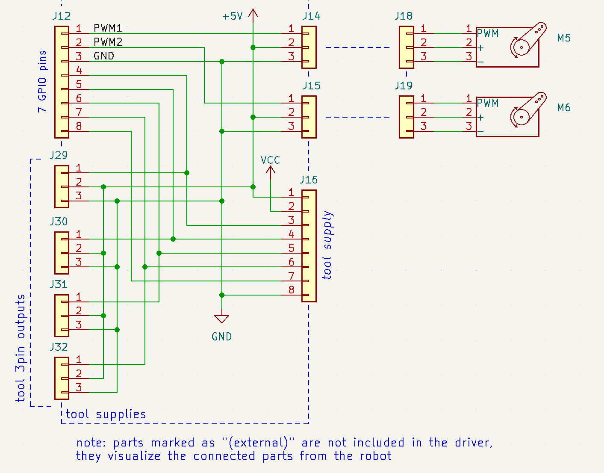

# Robot driver 

*Documentation for version: Mk1.1.2*  
*Schmatic version: Mk1.1.1*  
*Last updated: 11/04/2023*

## Overview

- [Summary](#summary)
- [Power supply](#power-supply-j1-plug)
- [Stepper controller unit](#stepper-controller-unit)
- [Measurement unit](#measurement-unit)
- [Tool supply unit](#tool-supply-unit)

## Summary

A basic robot driver for controlling up to four stepper motors, eight measurement pins, advanced tools and additional functionalities. The circuit itself is a basic concept, so components can be switched or adjusted if neccessary.  

NOTE: This diagram does not include voltage/current limits, as they depend on which components are actually being used.

The GPIO pin requirements have been designed to fit a raspberry pi, so it is recommended to use a raspberry pi 3 or newer for this driver.

## Power supply (J1 plug)

The driver needs two different supply sources: A control voltage with about 5V and a power voltage, usually between 12-48V. Both grounds are unified to a single one and the microcontroller, that sends the logical signals for the drivers, has to be connected to the ground and control voltage.

## Stepper controller unit

When it comes to precise movements, the stepper controller unit is the main part in play. Each motor is connected with a plug (**J3 - J10**), so it can be easily changed or replaced. 

Logic control happens over the [J2 plug](#j2-plug).

### J2 plug

The [J2 plug](#j2-plug) consists of 10 pins, where 9 of them are GPIO ones (one GND). All motors can be disabled using the enable pin, as they have been unified to a single one. 

The remaining eight pins are four PWM-pins (often referenced as "step"-pins too) and four DIR-pins, both for each controller. The maximum frequency of the PWM-signal depends on the controllers used. 

## Measurement unit

The measurement unit enables a connection of up to eight switches (default ON), each one being connected to a LED for debugging. The resistors have a high value, as the current flowing into the microcontroller should be as low as possible.

## Tool supply unit

When it comes to completing more complex tasks, then advanced tools are required, which can take a lot of resources to maintain. Therefore, the tool supply has to be as flexible as possible to cover most of the different applications.

The tool supply has one input plug (**J12**) and three output plugs, two of them being servo output plugs (**J14**, **J15**) and one general purpose one (**J16**).

Using the PWM pins on the input plug (1 and 2 on **J12**), up to two servos can be controlled, as it is often required. Furthermore, the general purpose plug is equipped with both control and power voltage and, as it is required, a GND. 

